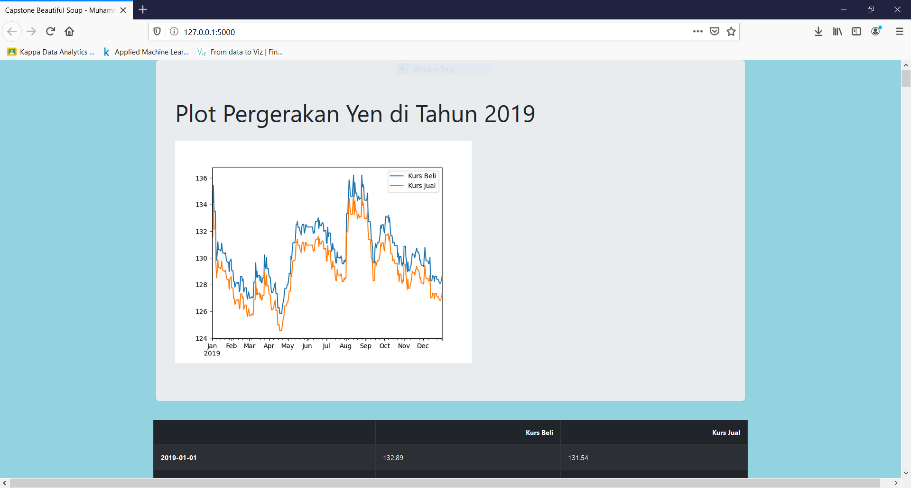
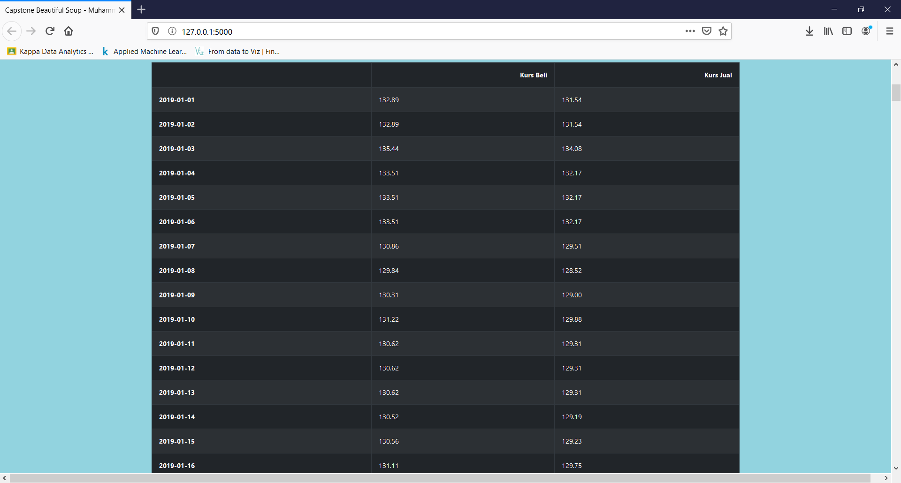

# Web Scraping Algoritma Capstone for Yen Currency in 2019
This repository is for completing Data Analytics Capstone Project from Algoritma Data Science Academy.

## Trend in 2019

## Analisa
Hasil analisa dari grafik diatas: 
  > Kurs terrtinggi terjadi pada bulan Agustus - September
  > Kurs pada tanggal 1 Januari 2019 dan tanggal 31 Desember 2019, mengalami penurunan
